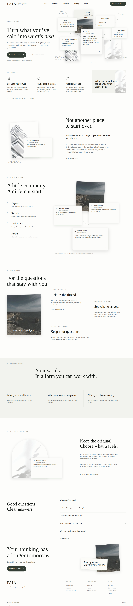

# PAIA — Continuous Editorial v1

**完整官网设计包 / Design only. Not a website implementation.**

This package expands the owner-selected opening into a complete bilingual public website. It does not change `index.html`, `website/`, `assets/website/`, the extension, deployment settings or data permissions. The opening retains its editorial composition; the rest of the site extends that composition rather than reverting to a SaaS feature-card template.

## Start with the actual pictures

- [Full English homepage, 1440 px](previews/home-en-1440.png) · [editable vector](artboards/home-en-1440.svg)
- [Full English homepage, 390 px](previews/home-en-390.png) · [editable vector](artboards/home-en-390.svg)
- [完整中文首页，1440 px](previews/home-zh-1440.png) · [中文移动端](previews/home-zh-390.png)
- [Owner's supplied opening, reference derivative](assets/owner-reference.webp)
- [Every frame](specs/frames.json) · [Contact sheets](previews/CONTACT-SHEETS.md)

## What is actually included

Every public route below has an English and a Chinese desktop artboard, plus an independently composed mobile artboard. SVG text remains editable; photographs are embedded so the vector reference does not depend on remote image URLs. PNG proofs are the font-independent visual targets. Per-frame geometry records all named text, crop windows, coordinates, rotations, paint order and Bézier paths.

| Page | Desktop English proof | Route |
|---|---|---|
| Home | [Full page](previews/home-en-1440.png) | `/` |
| How it works | [Four editorial chapters](previews/how-it-works-en-1440.png) | `/how-it-works.html` |
| Use cases | [Staggered index](previews/use-cases-en-1440.png) | `/use-cases.html` |
| Ongoing projects | [Complete scenario](previews/case-projects-en-1440.png) | `/use-cases/projects.html` |
| Career & decisions | [Complete scenario](previews/case-career-en-1440.png) | `/use-cases/career.html` |
| Research & learning | [Complete scenario](previews/case-research-en-1440.png) | `/use-cases/research.html` |
| Our story | [Editorial manifesto](previews/our-story-en-1440.png) | `/about.html` |
| Journal | [Editorial index](previews/journal-en-1440.png) | `/blog.html` |
| Context essay | [Complete article](previews/article-context-en-1440.png) | `/journal/context-is-a-practice.html` |
| Expression essay | [Complete article](previews/article-beliefs-en-1440.png) | `/journal/words-and-beliefs.html` |
| Editing essay | [Complete article](previews/article-edits-en-1440.png) | `/journal/keep-thinking.html` |
| Your data | [Practical boundaries](previews/your-data-en-1440.png) | `/principles.html` |
| Questions | [All answers](previews/faq-en-1440.png) | `/faq.html` |
| Private beta | [Form and scope](previews/beta-en-1440.png) | `/beta.html` |
| After application | [Unconfirmed receipt state](previews/thanks-en-1440.png) | `/thanks.html` |
| Current status | [Truthful capability ledger](previews/status-en-1440.png) | `/status.html` |
| Public example | [Selection demonstration](previews/example-en-1440.png) | `/demo.html` |
| Photography | [Credits](previews/credits-en-1440.png) | `/credits.html` |
| Privacy | [Existing legal text, new layout](previews/privacy-policy-en-1440.png) | `/privacy-policy.html` |
| Terms | [Existing legal text, new layout](previews/terms-en-1440.png) | `/terms.html` |
| Not found | [404 state](previews/404-en-1440.png) | `/404.html` |

Replace `-en-1440` with `-zh-1440`, `-en-390` or `-zh-390` for the corresponding complete artboard. Additional interaction specimens and two 1200×630 social cards are included. Article content is authored draft copy, not a fabricated publication history.

## Implementation handoff order

1. Read [AUTHORITY](AUTHORITY.md), [ART DIRECTION](ART_DIRECTION.md) and [FIDELITY CONTRACT](FIDELITY_CONTRACT.md).
2. Open the relevant PNG at 100%; inspect the vector and matching `specs/*.geometry.json`.
3. Use the exact [asset manifest](assets/manifest.json), [font lock](specs/font-lock.json), [tokens](specs/tokens.json) and [copy](copy/).
4. Follow [responsive rules](RESPONSIVE.md), [interactions](INTERACTIONS.md) and [routes](ROUTES.md).
5. Run the visual acceptance procedure. Do not call a DOM test an aesthetic approval.

## Read the boundary correctly

The user approved the supplied opening's **visual direction** and requested this extension. The newly authored whole site is **DESIGN_ONLY / OWNER_VISUAL_REVIEW_PENDING**; do not invent owner approval of every new page. This package does **not** authorize implementation, deployment, form submission, new permissions or publication of new legal commitments.

The source screenshot's exact font and original photographic sources were not established. This package therefore fixes explicit font choices and licensed photographic replacements, instead of leaving those decisions to a future developer. The originals' compositional roles, overlap, crop intent and hierarchy are retained. New PNG/SVG artboards—not a generated image's unavailable internal layers—are the reproducible baseline. This is a concrete design contract, not a claim that every future developer or browser will automatically comply.

No font files or private archive data are distributed. The design authoring utilities create static documentation assets only; they are not a second website implementation.
