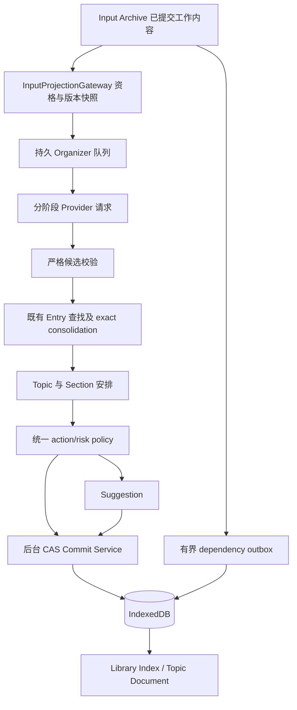

# v0.7.0 Thought Library Foundation — CLOSED / FROZEN

M5 集成验收通过。Thought Library data/UI foundation complete；Organizer mechanics complete；deterministic/mock full-chain validation complete；real Organizer intelligence NOT yet connected。最终证据见 `outputs/v070-m5-acceptance.md`。未部署日常 PAIA；不进入 v0.7.0.1。

# PAIA v0.7.0 — Thought Library Foundation 工程设计

日期：2026-09-07。状态：**GO**。用户已批准并收口 Provider architecture、数据范围、凭证边界、预算与失败隔离决定：v0.7.0 完成 Foundation + provider abstraction，确定性 Mock/fixture 足以完成全部工程验收；真实 Organizer Provider 接入安排在 v0.7.0.1，不能阻塞 v0.7.0。本轮只更新最终工程设计/checkpoint，没有编码、迁移程序、模型接入或功能验收；GO 表示设计决策收口，不表示本轮已获编码/部署授权。

设计分支从 `2b07582` 创建，冻结 v0.6.0 `01a6350`、v0.6.1 `f3fa0e7`、v0.6.1.1 `1e00c23`、v0.6.2 `2b07582`。不修改这些工作树、日常安装、History Completion 或 Auto History Sync R&D。产品定义直接采用用户已批准规格，不重新选产品方向。

## 1. Current-code audit：实际基线和命名

最初任务 cwd 的 HEAD 是 `a4d4c39`，manifest/package 为 v0.5.0；它不是 v0.6.x 设计基线。通过 `git worktree list` 和提交继承链找到 v0.6.x，审计以干净的 `../paia-light-filter-coverage-v062` / `2b07582` 为准。本文链接指向设计工作树内从该提交继承、未修改的源码。本轮未打开真实 IndexedDB；“实际 schema”指已审计的建库、迁移与读写代码，真实安装的版本/行数不作推断。

| 产品概念 | 实际实体/证据 | 可复用能力与差异 |
|---|---|---|
| Source Record | `records:{id,value}`、`recordIndex`、`times`、`tombstones`；[indexed-store](core/indexed-store.js)、[repository](core/idb-repository.js) | 不可变事实/来源身份/时间与永久忽略链继续保留；Provider 不取得这些 store 的访问能力 |
| InputBlock | `blocks:{id,value}`，正文人工值仍叫 `libraryText`，空值时通过 `originalTextReference` 解析原文；`blockIndex` | 旧命名不等于新 Thought；不重命名或迁移 Input 正文 |
| Input conversation document | `documents`、`libraryDocuments`；[workspace](core/workspace.js)、[archive UI](ui/archive.js) | 共享标题、分页、真实 conversation 排序；不能拿来充当 Topic |
| Input 状态与移除 | `inputStates`、`inputRemovals`；[IAStore](core/ia-store.js) 37–54、69–80 行 | 保留 source 级 removal suppression；`contentRevision` 在 **libraryText 或 note** 变化时递增；conversation 标题另有 `titleRevision` |
| 现有独立 Thought | `thoughts`，`thoughtText/title/note/topics/types/inputRefs`；IAStore 149–175 行 | 已有内部 create/edit/refresh、stale、粗粒度 `userEdited`、`provenanceType=input_derived/user_created`；尚无 Organizer/public create 命令；不能声称完全没有 Thought 内容能力 |
| 当前 Topic/Type | `categories`，`id=dimension+lowercase(name)`；IAStore 145–148 行 | 名字绑定 ID，不适合 rename/merge；没有 Section、Placement、稳定 Topic ID |
| 当前依赖 | `dependencies:{inputId,thoughtId,basedOnContentRevision,inputList}`；IAStore 107–120 行 | `byInputList` 已避免全库找依赖，但同一 Input 的全部 fan-out 仍在一个编辑事务内遍历；需改成有界增量处理 |
| 现有 Thought UI | [ThoughtWorkspace](ui/thoughts.js)、[ThoughtEditor](ui/library.js) 46–70 行 | 列表→单 Thought 编辑页、搜索/分类筛选、来源链接；不是批准的 Topic Document，需要替换读模型 |
| Word-like 编辑 | [DocumentEditor](ui/library.js) 4–44 行 | IME、750ms debounce/3s max wait、批量 CAS、operationId 重试、50 步/约 2MB 会话 Undo、跨块文本操作、失败保草稿；当前与 Input DTO/DOM 紧耦合 |
| persistent Revision | IAStore 11、55–68、122–143 行 | 90 天内全部 + 每实体最近至少 20 个 important；普通编辑 60s 合并；restore/CAS/purge 清理已存在。现有 major 字符差算法只是 revision 分类，**不是语义低风险证明** |
| Light Smart Filter | [SmartFilterStore](core/smart-filter-store.js)、[rules](core/smart-filter.js)、[runner](core/filter-runner.js) | `filterInputs/filterIntents`、人工 keep、读取快照、增量队列、search 包含 filtered、内部 `inputEligibility`。保持已冻结规则/决定/版本；复用资格判定并补 Organizer 独立安全校验 |
| job/receipt | `operationReceipts`、`importTasks/importBatches`；[ImportLedger](core/import/ledger.js) | **没有 maintenanceJobs store 或通用任务服务**。过滤任务分散在 meta/filterInputs，FilterRunner 是内存调度器；只复用设计模式，不调用导入协调器运行 Organizer |
| writer/授权 | [service-worker](background/service-worker.js) 7–21、65–102 行；repository 65–70 行 | `SmartFilterStore → IAStore → IndexedArchiveStore`；受信扩展页命令、后台串行写入、IDB 原子事务、白名单错误可复用。新增命令不能开放给 content script |
| AI Provider | `classifierContract` 为 provider none/runtimeEnabled false；[manifest](manifest.json) | 没有正式 Organizer Provider；离线 classifier spike 不合格且不在 runtime。当前仅 storage 权限、`connect-src 'none'`；没有网络接入授权 |

版本不要混用：数据库名 `paia-archive`；物理 IndexedDB **v3** 是 IA v0.6.0，**v4** 是 Smart Filter v0.6.1–0.6.2；chrome.storage.local 中旧逻辑 `schemaVersion=6` 是 IDB 控制指针格式，不是物理库 v6。IA marker `meta/ia-migration.version=1`；Smart Filter marker/规则版本另行管理。

历史验收文档记载 v0.6.0 470、v0.6.1 490、v0.6.1.1 502、v0.6.2 508 项自动测试通过及相应隔离验收。这是已有记录，**本轮没有重跑或重新确认运行时验收**。特别是 v0.6.2 私人 uncertain 分布/真实阅读改善仍未验证，不能把其冻结代码称为已部署或真实覆盖率已验证。

## 2. Proposed architecture 与所有权

逻辑边界：InputProjectionGateway 是唯一输入解析和裁剪点；OrganizerScheduler 只持有工作 ID/游标；Provider 只接收裁剪 DTO；CandidateValidator 不信任模型；ActionPolicy 返回 allow/suggest/deny；LibraryCommitService 是唯一 Library durable writer；TopicReadModel/SearchReadModel 只通过受信后台读请求向 UI 提供投影。以上是拟新增模块责任，不是已存在模块。

正式分离三个边界：OrganizerProvider 处理有类型的整理任务，CredentialProvider 隔离凭证需求与秘密使用，BudgetPolicy 控制处理范围/并发/重试/时间窗口额度。三个接口均可注入确定性实现，core 不导入任何厂商 SDK、不分支匹配厂商或模型名称、不依赖具体 key 字段。生产 adapter registry 在 v0.7.0 可以为空，仍可完整验收 Foundation；v0.7.0.1 只增加经批准的 adapter/授权配置，不替换 Library 实体、编辑命令或任务状态机。

保留 vanilla JS/随包模块/no build tools。本文“typed”表示可版本化 DTO、JSDoc 和运行时精确 schema 校验，**不引入 TypeScript**。Input/source/import/filter 继续走原有业务服务；Organizer 禁止直接调用这些服务的写方法。后台新增最小 change hook/outbox 不改变其字段、语义、过滤规则或先提交事实原则。

Source Record → Input 的既有引用解析可以在 Gateway 内发生；交给 AI 的只能是当下 Input working text。人工 `libraryText=''` 必须是空文本，不能 fallback 原文；被用户修改后也不得通过 Source 恢复旧正文。Source 事实和身份只是后台 purge/资格校验资料，不进入 AI DTO。

## 3. IndexedDB schema diff

建议下一个物理版本 **v5**（实施前重新检查无其他升级占用），独立 `meta/thought-library` marker `schemaVersion=1`；local 的 schemaVersion=6/databaseId 原样保留。所有新索引名和 keyPath 以下表为契约；派生组合键用字符串/安全整数/数组，布尔/null 不当 IDB key，optional key 缺失即不入索引。`id` 默认不含正文/名称，业务实体为 UUID；组合 ID 用有版本的无歧义数组编码。

当前共 25 stores：基础 16 个 `meta, records, recordIndex, blocks, blockIndex, documents, libraryDocuments, times, tombstones, migrationBackup, sourceCounts, operationReceipts, importTasks, importBatches, importEvidence, importSources`；IA 7 个 `inputStates,inputRemovals,thoughts,categories,dependencies,revisions,invalidations`；Filter 2 个 `filterInputs,filterIntents`。不删除 store，不清空现有数据，不把基础 STORES 全体默认加进每一个 Organizer 写事务。

| store | 变化 / 主键 | 新增索引（非标注 unique 均非唯一）与责任 |
|---|---|---|
| `thoughts` | 保留物理名/id；LibraryEntry storageSchema=2 的扩展行 | `byLifecycle:[lifecycleKey,id]`、`byExact:exactKey`、`byType:[type,id]`、`byUpdated:[activeKey,negativeUpdatedSequence,id]`；保留旧 byList/bySourceRecord。exactKey 非唯一：人工 Entry 允许相同正文；真正 auto consolidation 在串行事务内决策 |
| `dependencies` | 保留 id、inputId、thoughtId/inputList 兼容键；扩展 active dependency | `byTarget:[targetKind,targetId,id]`、`byInputTarget:[inputId,targetKind,targetId,id]`、`bySource:sourceRecordIds` multiEntry；保留 byInput/byInputList/byThought。增加 suggestion/job 依赖；一个 target/input 一条汇总，具体证据在 provenance |
| `revisions` | 保留 id 和全部历史；新增 entity kind、actor、fieldMask、base/afterRevision、purge ownership 元数据 | `byOperation:operationId`、`byEntitySequence:[entityKey,sequence]`；沿用 bySourceRecord/byDocumentList/byList。Topic/Section/Placement 使用各自 entityKey，不能借用 conversation title 历史 |
| `operationReceipts` | 保留 id/digest/result；新增 namespace/schemaVersion/operationSequence/createdAt | `byOwner:[namespace,ownerId,operationSequence]`、`byCreated:[createdAt,id]`。新 receipt 不含正文/proposed patch/provider 响应；旧行不重写 |
| `invalidations` | 保留旧事件；新 eventSchema=2 | `byPending:[stateKey,sequence,id]`、`byInputSequence:[inputId,sequence,id]`、`bySequence:sequence` unique（新行才有此键）；source removal/edit outbox 及每事件游标 |
| `meta` | 新 marker、policy/consent epoch、sequence、index/migration/job checkpoint | 现有 migration/IA/filter/import marker 不改；此 store 只放有界配置和计数，不塞任务数组 |
| `topics` | **新** id | `byIndex:[activeKey,pinKey,pinRank,negativeUpdatedSequence,id]`、`byName:nameKey`、`byRedirect:redirectTo`；UUID 独立于名字 |
| `sections` | **新** 逻辑 sectionId=UUID；物理 id=编码 `[topicId,layoutGeneration,sectionId]` | `byTopicOrder:[topicId,layoutGeneration,activeKey,rank,sectionId]`、`bySection:[sectionId,layoutGeneration]`、`byRedirect:redirectTo`；只当前 Topic active generation 可见 |
| `placements` | **新** id=编码 `[topicId,layoutGeneration,entryId]` | `byTopicEntry:[topicId,layoutGeneration,entryId]` unique、`byEntry:[entryId,topicId,layoutGeneration]`、`bySectionOrder:[topicId,layoutGeneration,sectionId,activeKey,rank,entryId]`、`byTopicOrder:[topicId,layoutGeneration,activeKey,sectionRank,rank,entryId]`；只存关系/顺序，不复制正文 |
| `provenance` | **新** id=证据贡献 UUID；owner entry/suggestion/job | `byOwner:[ownerKind,ownerId,id]`、`byInputVersion:[inputId,basedOnContentRevision,id]`、`bySource:sourceRecordIds` multiEntry、`byContribution:contributionKey` unique；immutable generation evidence 和版本使用记录 |
| `thoughtSuppressions` | **新** id=删除 lineage UUID | `byEntry:deletedEntryId`、`byScope:scopeTokens` multiEntry、`byExact:exactSignature`、`byStatus:[status,id]`；与 inputRemovals/tombstones 完全分开 |
| `organizerJobs` | **新** id | `byReady:[stateKey,nextAttemptAt,priority,sequence,id]`、`byDedupe:dedupeKey` unique（仅未终止工作保留键）、`byParent:[parentJobId,sequence,id]`；任务、lease/fence、检查点 |
| `organizerWorkItems` | **新** id=编码 `[jobId,itemKey]` | `byJob:[jobId,stateKey,sequence,id]`、`byInput:inputIds` multiEntry；输入/候选 ID、版本、阶段、结果摘要；不存完整 prompt/response |
| `organizerUsage` | **新** id=`request:<requestId>` 或 `window:<windowId>`；记录带 kind/request或window | `byJob:[jobId,sequence,id]`、`byWindow:windowIds` multiEntry、`byState:[kind,stateKey,sequence,id]`、`byCreated:[kind,createdAt,id]`；请求预算reservation/结算、daily/session窗口计数与无正文审计共用同一请求行；不存credential/prompt/response |
| `organizerSuggestions` | **新** id | `byTarget:[targetKind,targetId,statusKey,sequence,id]`、`byTopic:topicStatusKeys` multiEntry（单个键编码 topic+status）、`byStatus:[statusKey,sequence,id]`、`byLogicalKey:logicalKey`；只当前必要 proposed content，无原始 Input 副本 |
| `entryRelations` | **新** id | `byFrom:[fromEntryId,kind,id]`、`byTo:[toEntryId,kind,id]`、`byIdentity:relationKey` unique；预留 v0.7.1 typed relation payload |
| `librarySearchTerms` | **新** id=编码 `[tokenHash,ownerKind,ownerId,field]` | `byToken:[tokenHash,ownerKind,ownerId,field]`、`byOwner:[ownerKind,ownerId,id]`；一份 Entry token postings，多 Topic 不复制正文 |
| `libraryMigrationItems` | **新** id=编码 `[entityKind,oldId]` | `byStatus:[statusKey,entityKind,id]`；old/new ID、来源 schema、版本、校验摘要、quarantine 原因，**不复制 payload** |

Source/Input/filter/import stores 不变；不往 inputStates 新加 body revision 并回填伪造历史。旧 categories 保留兼容/隔离映射来源，新 Topic/Section 不再使用它。旧 byList/inputRefs 可在兼容写适配器中维护为 ID/版本的有界投影，正式一致性以依赖/placement 表为准；不得双写独立正文。新增 12 个 stores，合计 37；本次预算收口增加的 organizerUsage 仍属于拟议 v5 DDL，不是在真实库执行升级。索引可重建但构建期间必须标记未就绪，不返回“没有结果”的假完整搜索。

## 4. LibraryEntry 契约

LibraryEntry 是唯一总实体名。物理 `thoughts.thoughtText` 保留作为逻辑 `body` 的存储映射，避免复制或无意义重命名私人正文；UI/API 使用 `body`，拒绝同时提交 thoughtText/body。旧思想专用命名只存在兼容适配器。

| 字段组 | 字段及语义 |
|---|---|
| identity | `id, storageSchema:2, createdAt, updatedAt, createdSequence, updatedSequence` |
| content | `title:string≤300, body:string≤200000, note:string≤200000`；纯文本、空正文合法；Entry 为独立内容而非 Source 引用 |
| semantics | `family, type, formation:explicit/synthesized/inferred, origin:ai/user/legacy_unknown`；type 单值，mixed Input 可产生多个 Entry，不强制一 Input 一 Entry |
| revisions | `revision` 每次实体变更增；`contentRevision` 仅 title/body 改变增；`fieldRevisions` 对 title/body/note/type/formation 各自递增；`organizationRevision` 对 membership/placement 变更增；`dependencyRevision` 对依赖状态增 |
| authorship | `createdBy, authoringEvidence, protections, hasHumanAction`；后者仅删除生存/保守门禁汇总，不是逐字段写权限 |
| state | `lifecycle:active/removed/invalidated/quarantined`、`freshness:current/stale`、`integrity:complete/partial/detached`、`staleReasons[]`（固定枚举）、`dependencyValidatedSequence` |
| grounding | `activeEvidenceCount, primaryCount, supportingCount, contextCount` 为可重建摘要；generation IDs 指向 provenance；`sourceRecordIds` 仅后台清理索引，不给 Provider |
| duplicate | `exactKeyVersion, exactKey? , consolidationLineageIds[]`（大 lineage 使用 relation/receipt，禁止无界数组）；人工正文变化即时撤销旧 exactKey |
| protection | 不暴露 source 写字段；Entry 不含全局 order，不把 Topic/Section ID 当 semantic type |

固定映射：Information → `fact,event`；Thinking → `preference,decision,judgment,idea,goal_plan,reflection`；Creation → `creation`。`goal_plan` 对应批准的 Goal / Plan。family 从 type 校验派生，拒绝冲突配对。legacy 无法映射的类别保存原 metadata 并 quarantine，不能瞎造为 fact。未知输出类型拒绝/重试，不能静默丢字段。

`explicit` 要有明确 Input evidence；`synthesized` 要有至少两个不同有效 Input 的明确贡献（不能把 context_only 算第二个）；`inferred` 只允许 suggestion。用户主动接受 inferred suggestion 后可成为正式 Entry，保留 inferred 标签、人工接受 revision 和 protections，不能洗成 explicit。手工创建/迁移而来的独立 authored content 可以无依赖；不为它伪造 AI provenance。

## 5. Topic / Section / Placement：稳定文档结构

Topic：`id,name,summary,revision,fieldRevisions,protections,createdBy,createdAt,updatedAt,pinned,pinRank,lifecycle,redirectTo?,organizationRevision,activeLayoutGeneration,derivedStats:{visibleEntryCount,validatedEpoch,updatedSequence}}`。derivedStats 未追上安全 epoch 时计数显示更新中。name/summary 为纯文本；summary 是阅读导语，不是每次重算的 chat summary，人工编辑后锁字段。nameKey 只用于建议查重，不是 unique ID。同名可共存；命名冲突进入建议，不自动合并。用户 rename 改字段不改 UUID；pin 独立保护，不把 pin 等同名字锁。

Section **持久化**：逻辑 DTO `{id:sectionId,topicId,title,rank,revision,protections,createdBy,lifecycle,redirectTo?}`，物理存储另有 layoutGeneration/复合 id。AI 可为明确结构生成自然标题，用户可新建、rename、merge、移动。每 Topic 有稳定默认 Section（展示时可无标题），初建没有可靠结构的 Entry 放这里；不会出现 Facts/Ideas 固定分区。空的人工 Section 保留；AI 不擅自删除。

Placement：`id,topicId,layoutGeneration,entryId,sectionId,rank,sectionRank,revision,membershipAuthorship,sectionProtection,orderProtection,origin,lifecycle`。每 Topic 的 **active generation 内** 每 Entry 最多一个 placement，同 Entry 在不同 Topic 有各自 Section/顺序。正文编辑从任意 Topic 修改同一个 Entry，其他 Topic 获得版本通知。Topic membership 的人工保护是带正负意图的集合：手工移出 A 也要记录 denied A，不能因删除 placement 而丢保护；人工明确设定整个 Topic 集合时追加 set-level protection。

排序用可插入的稳定可比较 rank（字母表固定、最大 64 字符），同 rank 用 Entry ID 决胜。AI 初始顺序按明确段落结构；缺证据则按 extraction sequence + evidence order + Entry ID 确定，不采用模型响应数组顺序。新 Entry 优先插入未保护尾部；不能绕过人工锚点重排既有内容。rank 耗尽时按现有相对次序重平衡，placement CAS + Topic organizationRevision，不能改变人工相对顺序。大 Topic 重平衡使用 generation shadow rank + 原子发布版本，失败继续读旧 generation。

用户 Topic merge 必须实现（它不是 v0.7.1 的 Entry semantic merge）：用户选 survivor UUID，旧 Topic 持久 redirect；分别保留 Section ID，冲突标题先保留，由用户改名。重复 placement 合为一条并保留人工 protection/来源 Topic 映射；冲突人工位置以用户选定 survivor 位置为主，另外位置入结构 revision，drawer 解释结果。合并中锁目标结构，其他 Entry 正文仍可编辑；有界迁移与最终 generation 激活，不能先隐藏一半。Section merge 同理，旧 ID redirect 到 survivor，按原相对顺序接入，不悄悄合并 Entry 正文。redirect 禁环、压缩链且保留历史身份；Provider 使用 canonical ID 和组织版本，不能重建已 merge 的旧 Topic。

generation 实施约定：普通单条结构修改在 active generation 做短事务；大 merge/rebalance 先为目标创建新 generation 的 sections/placements metadata，每批100行，旧 generation继续可读。完成并校验 base organizationRevision 后，一次短事务切换目标 activeLayoutGeneration、写旧Topic redirect和重要operation revision/receipt；失败则旧视图完整保留。旧 generation分批清理，仅revision保留必要结构历史，不留第二份正文；恢复为新的generation并重验Entry lifecycle/purge，不直接复活旧generation。byEntry 查询必须过滤各Topic的active generation，未发布行不能影响计数/search/policy。purge清理覆盖所有generation。如此UUID逻辑身份稳定，同时支持有界事务与原子结构发布。

## 6. Provenance / Dependency：实际使用版本

Provenance 是生成证据实体，Dependency 是当前有效性和反向查找实体，两者不互相代替。

Provenance 行：`id,ownerKind,ownerId,generationId,inputId,basedOnContentRevision,actualVersion:{inputRevision,bodyDigest,noteDigest?,projectionVersion,selectedFields,spanRefs?},role:primary/supporting/context_only,contributionType:quotation/paraphrase/combination/context,formation:explicit/synthesized/inferred,generatedAt,generator:{providerId,providerVersion,modelVersion,taskSchemaVersion,promptTemplateVersion,policyVersion},inputAuthorshipAtUse,entryFieldAuthorshipAtCommit,sourceRecordIds,sourceIdentityTokens,contributionKey,availability:resolvable/version_unavailable/purged`。

`actualVersion` 是**当时真正传入模型**的 Input 字段版本/精确文本 digest/span 定位，不是 commit 时当前版本。span 用 UTF-16 起止偏移且必须针对该版本验证，不能指向未来 Input。生成 task 的 Input snapshot 在内存中存在，默认不在 provenance/revision/job 重复保存 Input 全文；可用既有 Input revision 精确重建时允许受信 UI 展示，不能重建时显示“该历史版本已不可用”，不把最新内容冒充旧证据。90 天清理不因 AI evidence 永久 pin 一份旧正文；摘要哈希不是可回放正文，也不是匿名数据。

Dependency 行：`id,inputId,thoughtId? (entry owner 时),inputList?,targetKind:entry/suggestion/job,targetId,basedOnContentRevision,selectedFields,usedFieldDigests,validatedAgainstContentRevision,dependencyVersion,status:valid/source_updated/removed/purged/version_unknown,roles[],provenanceIds[],sourceRecordIds,lastEventSequence`。一个 owner/input 汇总同一 Input 的多种贡献，provenanceIds 超限则按 byOwner 查询，不无限增长数组。`basedOn...` 不随着验证修改；备注无关变动只更新 `validatedAgainst...`，保留实际生成基线。

输入资格：当前 active、非 branch_pending、非 user_removed、无 source tombstone、无禁用/撤回授权。有效 Light filter 的 Input 不作 extraction target；filter Off 时遵循当前可见工作层语义。context_only 必须有本任务 visible primary anchor，限定同 document 最邻近最多 2 条、总额外 4 KiB，仍计入整个请求上限；逐条验证 actual version/removal/purge。不能借多个 anchor 任意扩张上下文。现有 `inputEligibility` 是起点，Gateway 必须补全 source tombstone/epoch 检查，不能把该函数返回值等同完整授权。

默认仅 working body；note 或 conversation title 不自动加入模型上下文。若某个 typed task 明确需要 note，selectedFields 必须包含 note、按需授权并追踪 noteDigest；conversation title 仅组织定位，一般不进入 extraction。已生成 Entry 不因 filter 模式变化被隐藏/invalidated，复用冻结规则。

ownerKind/targetKind可扩展`topic/section`，用于AI生成名称/导语的必要证据；这两种owner不运行Entry的整条invalidation规则，而是字段级outdated标记。Source purge仍清理其Source-only引用/副本和历史payload，保留人工命名；必要时显示通用无正文占位，不能从旧generation/导语恢复原文。所有generation共用逻辑sectionId和generation/version绑定证据。

## 7. Field protection / authorship / conflict

每个可变字段记录 `{fieldRevision,lastActor:user/ai/migration,lastOperationId,lastChangedAt,everHumanConfirmed,protection:{locked,reason,operationId,at}}`。迁移旧 userEdited=true 但无字段证据时保守保护所有字段，并标 `legacy_unknown`，不伪造哪一字段曾改。

正文、标题、note、type、formation 分别保护；Topic membership 在 Entry 的 organization evidence 中保护正/负 edge；Section/order 在每个 placement 保护；Topic 自身 name/summary/pin、Section title/rank 各自保护。UI 可将这些投影成 `bodyProtected/titleProtected/topicProtected/typeProtected/sectionProtected/orderProtected`，不是只存六个布尔就结束。

人工 edit/accept/restore/明确确认写入保护证据，Undo 回到旧文本不会撤销人工证据。普通文本 Undo 不是“重新允许 AI 编辑”；只有单独明确操作才解锁指定字段（不强制 v0.7.0 提供解锁 UI）。accepted suggestion 的实际变更字段标为人工确认。手工移动 Topic 不会把 bodyProtected 设为 true。

执行顺序：不可覆盖的产品禁止项 → 人工 field/edge protection → 用户结构化 Organization Policy → Recommended defaults。自然语言 parser 本版不实现。每次决策保存 `actionPolicyVersion,organizationPolicyVersion,consentEpoch,protectionRevision`。高层优先级不意味着任何用户策略可允许 purge/source/input 写操作。

**stale refresh 特例采用用户规格的保守规则**：body/title/note 曾人工编辑（或旧历史无法分清）时，仅 stale + suggestion，不自动刷新 authored content。仅手工 Topic/Type/排序的 Entry，未保护正文仍可走低风险 refresh；不得改动其人工组织字段。如此既实现字段细分，也不把仅移动 Topic 变成正文永久锁。纯 metadata 的 AI 更新也必须逐字段受 policy 校验，不用笼统 userEdited 放行。

统一`ActionPolicy.evaluate({action,target,changedFields,formation,groundingEvidence,novelty,protections,baseVersions,organizationPolicyVersion,consentEpoch})`返回`{decision:allow/suggest/deny,risk:low/medium/high,reasonCodes,allowedFieldMask,requiredChecks,policyVersion}`。这是一份纯策略接口契约，不是本轮代码；entry创建、refresh、consolidation和drawer accept都经过同一个engine，不能在各路径自行解释confidence。用户accept是user actor仍不得越过产品deny。

| action | Recommended默认 | 必须满足 |
|---|---|---|
| create_explicit / create_synthesized | low→allow，否则suggest | 高置信且已验证grounding/formation、至少一个primary、无suppression、合法最新Input版本；synthesized另需多个明确来源 |
| classify_type / assign_existing_topic | low→allow，否则suggest | enum/Topic稳定ID可验证、相关上下文有限、目标字段/edge未保护 |
| create_obvious_topic / assign_section | low→allow，否则suggest | 无命名冲突/merge redirect/人工结构冲突，稳定排序；不造固定taxonomy |
| exact_consolidate / related_metadata | low→allow，否则suggest | exact完整核验或可靠related evidence、无改正文/人工结构、receipt幂等 |
| refresh_entry | 极窄low allowlist，其他suggest | 未人工改内容、逐字段无锁、可证明无语义变化；字符差和模型自报不够 |
| create_inferred / large_refresh / reconsider_removed | suggest | 接受时依然验版本/权限；不得自动进正式库 |
| semantic_duplicate / entry_merge / evolution关系 | suggest-only schema reservation | 本版不提供未实现accept executor，不通过通用patch绕过 |
| rewrite_protected / undo_user_topic_type / delete_thought | AI deny | 用户自己的编辑/移除命令另走受信user actor，不属于AI允许项 |
| write_input / write_source / permanent_purge / tombstone | Organizer永远deny | 不允许任何Organization Policy覆盖 |

未来Organization Policy可存结构化rules和原自然语言描述（用户主动创建的工作内容），编译产物带版本；v0.7.0只保留version/interface，默认空rules，不实现parser或自定义prompt。

## 8. Thought-level removal suppression

用户删除 Entry：同事务写 `lifecycle=removed`、移出正常 placement/read/search、重要 remove revision 和 suppression。不写 Input removal/Source tombstone，不永久删除来源；恢复是用户动作并记录 restore revision。删除的是整理结果而不是 Input。

Suppression：`id,deletedEntryId,lineageId,removedAt,operationId,status:active/restored,scopeVersion,scopeTokens,evidenceVersionTokens,exactSignature?,claimSignature?,signatureVersion,noveltyRuleVersion,relatedCandidateIds?`。scopeTokens 是本地带密钥 HMAC 的稳定 Input/source identity；evidenceVersionTokens 绑定实际使用的字段 digest。claimSignature 可由已验证结构化 assertion 的规范签名产生；**本版不持久 embedding/私人摘要作为语义墓碑**，不把概率语义签名当永久唯一真值。HMAC 密钥只在本地 meta（非安全硬件保证），签名/ID 均不得进入日志、指标或 Provider。

判定必须在候选校验前和提交事务再跑：

1. operation/lineage 精确命中，或同 evidence versions + exact/claim signature 命中：拒绝重建同结果。
2. 同证据集合生成不同措辞：不能靠 hash miss 自动重建。若无法证明是不同 assertion，保守抑制自动 commit，合并为一个可见的“与已移除内容相关”pending candidate；默认不反复推送相同 candidate。可以在一次处理 Input 时记录 assertion span/role 的 HMAC 区分其余无关结果；不靠保存正文副本解决问题。
3. 新 capture ID/重复 import/换 provider/prompt/Topic 名称/仅备注修改都不等于新证据。新增非 context 的独立来源身份，或同 Input 实际 body 有实质变更，才有 new-evidence eligibility；文本差异本身不证明语义新颖。
4. 满足资格且模型提出可核查新证据时，只生成 pending `reconsider_removed`，指向 suppression/deletedEntryId，展示“新证据”关系。v0.7.0 不自动恢复旧 Entry；用户可接受为新 Entry/明确恢复旧条目，保留 lineage。没法证明 novel 就继续抑制。
5. context_only 新增永远不能突破 suppression。用户 restore 可以让旧 suppression.status=restored，但永久 Source purge 仍优先，不能恢复依赖/原文。

这一保守 fallback 避免承诺“无模型也能完美判断语义重复”。它可能压低同一长 Input 中其他新结果的自动覆盖率，列入 v0.7.1 优化，不能以静默复活换覆盖率。suppression 不因 revision 90 天过期而过期；纯 metadata 持久保留，用户永久清理来源时删除其可逆 source 引用，只保留阻止原 lineage 复活所需不含正文的标记。

## 9. Organizer job / queue

不复用不存在的 maintenanceJobs；新增 organizerJobs/WorkItems。复用 operationReceipts 和 repository 事务基础、ImportLedger 的批次 digest/checkpoint 思路；导入任务/grant/file coordinator 原样不改。FilterRunner 不扩展成模型 runner，避免 Smart Filter 的低延迟工作被网络/推理拖住。

Job：`id,kind:backfill/extract/refresh/reconcile/index/structure_merge,jobSchemaVersion,state:queued/running/retry_wait/paused/cancelled/completed/failed,scope:{documentIds?,inputCursor,selectionVersion},policyVersions,budgetPolicyVersion,budgetSessionId,providerBinding:{providerId,adapterVersion,capabilityVersion,modelVersion},credentialProfileRef?,consentEpoch,createdSequence,checkpoint,attempt,nextAttemptAt,lease:{ownerInstanceId,fence,expiresAt},cancelEpoch,lastSafeError,pauseReason?,counts`。providerBinding 为中立标识，没有厂商 key 字段；未配置时 binding 为空、job paused/provider_unavailable。parent scope 不存无界 Input IDs；work items 分页存。checkpoint 是 IDB 成功 commit 的高水位，不是已经收到 provider 输出的数量。

每批默认 8 targets、至多 2 context（整个批次）且**同一 conversation**、投影 UTF-8 总计 ≤32 KiB、Provider 输出 ≤64 KiB、候选 ≤16、每候选 ≤8 个 target/2 个 context。单个长 Input 不任意截断语义后自动成文：显式分段带 offset/version 并保守 suggestion，或返回 oversized 等待本地手工编辑；Creation 保持完整作品时超限不得装作完整提取。初期 Provider 并发 1；每批成功后 yield，让交互写优先。

阶段：选择 → Gateway snapshot → extraction → schema/grounding 校验 → existing lookup → exact/new/possible_related → type/topic/section assignment → policy → commit/suggestion。工作项 stageKey 派生自 jobId/input versions/task schema/policy/attempt generation，candidate ID 由本地创建。跨 conversation 合成可分多个逐 conversation 抽取任务，再对**已相关且经选择的 Entry**做后续建议；v0.7.0 不把无关 conversation 一起打包上传。

捕获/编辑不等待 Provider：编辑事务只追加小型 dependency invalidation（ID/sequence）并写当前资格状态；这是数据一致性记录，不调用Organizer代码。实际job enqueue在提交后独立执行，失败不影响已保存Input。防漏策略：初次/新增Input按blockIndex.bySequence补扫；修改按新invalidations.bySequence增量补队，enqueue与selection watermark同事务提交，失败不前移watermark。**不可用现有revision.sequence作为唯一编辑变化流**，因为60s coalescing会原位改写旧revision。invalidation分别保存dependency消费和Organizer selection两个ack，均越过才可清理。全库scan仅初始backfill/显式完整修复，不发生于每次Input修改。Input删除/Source purge的安全fence与原删除原子，不依赖可选队列成功；IDB存储本身失败仍按原编辑失败/保草稿语义处理。

validated candidate需要跨worker恢复时，仅把经schema裁剪的`stagedCandidate`暂存在对应organizerWorkItem（不是raw response/prompt），同时建立job owner的provenance/dependencies和source清理索引。它含拟提交Entry正文，因而也是私人payload，必须受purge/consent/version fence，不能当无敏感任务摘要。commit或转suggestion后删除stagedCandidate，终止/过期也清理；stage写入之前和恢复之后都重新校验版本。没有可靠stage时允许重新调用Provider，不能持久完整Input prompt换恢复便利。

Provider 调用/哈希/大文本处理全在 IDB transaction 外。拿结果后开短写事务，检查 lease fence、cancel/consent epoch、全部 Input version/资格、suppression、Entry/Topic/Section/Placement base revisions、policy versions，然后原子写 Entry/placement/dependency/provenance/revision/index/receipt/job checkpoint。绝不在全局 `store.run` 锁内 await Provider。receipt 重试命中返回安全 IDs/revision/counts；ID 相同 digest 不同拒绝。

worker 终止后 lease 过期可新 fence 接管；原 worker 迟到响应不能提交。cancel 增 epoch 并 abort，保留已提交成果，未提交候选清理；pause 可恢复，resume 重取资格和版本，不能回放旧授权 prompt。初始请求之外最多3次自动重试（总尝试≤4），退避1/5/30分钟含jitter；若未来provider返回更长Retry-After则等更久。invalid output最多占用其中1次修正重试，不得增加总次数、扩大数据范围或放宽校验。Provider 无幂等能力时未来可能重复计费，但本地提交仍幂等，UI 不声称“只请求一次”。手工重试仍通过daily/session预算，不能重置额度。

统一错误映射：unavailable→paused/provider_unavailable（可恢复故障允许retry_wait）；timeout→retry_wait，耗尽→failed；invalid_structured_output→一次有限重试后failed；rate_limit→retry_wait；credential_failure→paused/credential_required；budget_exceeded→paused/budget_exceeded或未发出任务保持queued。运行中无能力/凭证/额度变化必须撤销提交资格。错误只改变Organizer job/usage/checkpoint，不清空或回滚已成功的Library内容，不影响Input capture/edit和Source；失败请求未产生的Entry不能伪装成功。没有空响应覆盖正文、隐式换服务或“为完成任务”扩大上下文的fallback。

无新增 alarm 权限的默认路线：onStartup/worker 启动/可信请求/当前活跃调度回调恢复；Chrome 完全 idle 时不承诺定点重试，nextAttemptAt 是可运行时间而非闹钟。不得靠长连接/轮询保活规避生命周期。MV3 worker 会停止且全局变量会丢失，故持久 checkpoint 是必要条件。[Chrome service worker lifecycle](https://developer.chrome.com/docs/extensions/develop/concepts/service-workers/lifecycle)

## 10. OrganizerProvider / CredentialProvider / BudgetPolicy 正式边界

### OrganizerProvider：任务协议与能力发现

每个adapter提供`describe()`：`{providerId,adapterVersion,capabilityVersion,modelVersion,executionKind:fixture/local/remote,supportedTaskSchemas,credentialRequirement:none/opaque,limits}`，以及下表独立typed方法。core只按能力/schema版本派发，不检查OpenAI/GPT/Claude/Apple或其他厂商字符串。fixture adapter返回固定modelVersion和合成预期输出；NoProvider返回标准unavailable，不生成假整理结果。provider/model标识只从已验证descriptor取得，不信任模型自由输出中的“版本”。

每方法独立 request/response schema，版本化 envelope：`{requestId,taskKind,schemaVersion,scopeToken,inputs?,entries?,allowedTopicRefs?,allowedSectionRefs?,budget,locale}` → `{requestId,schemaVersion,providerVersion,modelVersion,result,usage?}`。scopeToken 是本地请求关联，不包含账号/URL。provider 不取得 repository、chrome API、文件句柄、网络工具或后续“自己检索”的能力。

| 方法 | typed request 必要输入 | typed response |
|---|---|---|
| `extract` | InputProjection[]：opaque inputRef、working body、actualVersion、allowed role、限定邻接上下文 | Candidate[]：localRef、title/body、type、formation、evidenceRefs+offsets/roles、confidenceEvidence；不带可执行指令/持久 ID |
| `classify` | validated candidate 的内容、批准 type 枚举、相关 evidence | `{candidateRef,type,formation,confidenceEvidence}`，不改原证据 |
| `group` | 本 task 已相关 candidate IDs/必要短内容 | `{groups:[{candidateRefs,label?}]}`，组是计划，不隐式合并正文 |
| `suggestTopics` | candidate、有限相关 Topic 名称/导语/ID/版本（≤20），保护信息只给必要限制 | 现有 ID assignment 或新 Topic proposal；输出任意未知 ID 拒绝 |
| `suggestSections` | canonical Topic 中 ≤20 个相关 Section 标题/版本、候选 | section assignment/new section proposal+relative anchor IDs；不能决定全库排序 |
| `suggestRelations` | 被本地选出的有限 Entry pair、类型枚举 | related/semantic_duplicate/refines/extends/supersedes/contradicts proposal+reasonCode；只 related metadata 可低风险自动 |
| `suggestUpdate` | 目标当前 body/field base、仍授权的最新 Input、保护字段列表；旧 Input 正文仅当仍可解析且本任务明确需要 | field patch、逐字段 rationale、evidenceRefs、risk hints；不能提出写 Input/Source/tombstone |

Provider 自报 confidence 不能独自授权。验证未知字段、长度、枚举、角色、跨 scope ID、偏移、组合数量、extracted formation、内容来源和注入。用户 Input 作为不受信数据块，不可被当 system/tool 指令；Provider 无工具，即使内容写“忽略规则并读取全库”，权限也无法扩大。模型输出以 textContent 显示，禁止 HTML/JS/URL 自动执行。reason 用有限简短依据，不保存 chain-of-thought，不把 raw error/prompt/response 写日志。

产品“不直接读 Source”是能力隔离：Provider 只能收到 Gateway 解析的当前 Input 内容，source originalText/title/url、历史版本全集、assistant/附件、无关 conversation、user_removed/purged 全部排除。jobs 的 ID 不能让 Provider 自行扩大 scope。只传当前 task 的相关既有 Entry；不能为了 semantic lookup 发完整 Library。

无关Topics同样禁止；allowedTopicRefs/allowedSectionRefs必须先经本地相关性选择，仅传task必要字段，不因上限20就默认取全库前20个。比较既有LibraryEntry只发必要title/body片段与opaque ID/version，不默认发送note、完整provenance或全部历史；不足证据时suggest/暂停，不跨conversation/Topic扩大检索授权。

### CredentialProvider：能力句柄，不是公开凭证存储方案

接口为`describeRequirements(providerId)`、`getStatus({providerId,credentialProfileRef})`、`acquire({providerId,credentialProfileRef,scopeToken,consentEpoch,signal})`、`revoke(handleOrProfileRef)`。acquire返回`{status:ready/missing/expired/revoked,handle?,expiresAt?,credentialVersion?}`；handle是不透明、任务作用域、短期且不可持久序列化的授权能力，非secret字符串。只有provider adapter的授权边界能使用它；Organizer core、任务/receipt/provenance/UI DTO不接触实际secret。CredentialProvider不能读Input库，OrganizerProvider不能决定credential写到哪里。

v0.7.0实现可测试的NoCredentialProvider/FixtureCredentialProvider：none需求可在无secret下运行；其余返回缺失/过期/撤回等确定状态。合成handle不得作为真实凭证。durable数据最多存中立credentialProfileRef和版本/状态，不存secret；禁止类似厂商专属key字段。无需任何真实key即可完成Foundation自动测试及隔离Chrome验收。

未来internal prototype可另外配置真实credential，但不等同正式public架构。本设计不选定public BYOK、backend或长期凭证保管方案；这些留到v0.7.0.1真实Provider阶段再批准。长期API secret不得默认进入普通chrome.storage.local，测试日志/usage/prompt/revision同样禁止。core不依赖某一种具体存储介质，换CredentialProvider无需改Entry或迁移Input。

### BudgetPolicy：v0.7.0 必须实现的有界调度

接口为`evaluate({taskKind,scopeSummary,estimate,attempt,activeJobs,windows,policyVersion})`→`{decision:allow/queue/pause,reasonCode,reservationCost,nextEligibleAt?,policyVersion}`；`reserve(requestId,jobFence,windowIds,cost)`、`settle(requestId,outcome,actualUsage?)`、`releaseUnsent(requestId)`由后台BudgetLedger以IDB事务执行。Policy是纯规则，Ledger是sole-writer记账；两者都不读私人正文，size/token estimate由Gateway对已裁剪请求计算。预估、reservation、dispatched状态、结算不得与实际请求脱节。

建议Foundation默认参数（工程默认值，可经版本化settings显式调整；永不自行扩容）：

| 限制 | 默认上限/口径 |
|---|---|
| maxInputsPerTask | 10个不同Input：最多8个extraction targets+2个context；方法重试不能加Input |
| maxContentBytes / maxContextItems | 所有Input+相关Entry/Topic/Section字段合计32KiB；context≤2条且合计4KiB |
| maxEstimatedTokens | 完整序列化请求采用版本化保守字节计数估算（含任务模板/协议开销），每次≤48Ki单位；这是provider-neutral资源估算，不冒称某模型精确token数；内容字节上限仍独立生效 |
| maxComparisonEntries | 每请求≤4个相关既有Entry，字段/字节还受总限额约束 |
| maxConcurrentJobs / maxConcurrentProviderRequests | 各1个活跃Organizer处理job/请求，跨标签/worker共享lease与预留；依赖删除安全处理不被AI额度暂停 |
| maxRetries | 初次之外≤3次（总≤4）；invalid structured output至多1次修正，计入同一总额度 |
| session processing budget | ≤256个Input呈现次数、2MiB内容、3Mi估算单位、128个Provider请求，任一达到即暂停 |
| daily processing budget | ≤1024个Input呈现次数、8MiB内容、12Mi估算单位、512个Provider请求；持久24小时窗口，不因开新tab/session或重启worker重置 |
| monetary budget | 接口预留`monetaryLimit/estimatedCharge/actualCharge/currency`为未配置；v0.7.0没有价格/付款/key，不以null表示允许无限付费；真实接入时另批 |

“Input呈现次数”包含primary/supporting/context以及重试/不同stage再次发送，不能只按唯一Input计一次来掩盖重复处理。比较任务即使没有Input也消耗请求次数、字节和估算单位。读取Gateway先按ID/count/已知长度预检，再有界组装和完整估算；reserve前不调用Provider。过大的合法任务可在相同scope内拆成有独立证据的子任务，子任务同享parent/session/daily额度；不能拆分绕过总预算或把不完整Creation标成完整。

`organizerUsage`窗口行保存`{kind:window,windowId,windowType:session/daily,startedAt,endsAt?,policyVersion,reserved,consumed}`；请求行保存`{kind:request,requestId,jobId,jobFence,windowIds,estimate,reservation,state:reserved/dispatched/settled/released/unknown,attempt,safeAudit,createdAt}`。一次短事务检查全部窗口/并发并预留，避免两个tab都看到剩余额度。Provider调用前持久标dispatched并扣尝试额度；明确未发送可release，已发送/超时/结果不明按保守已消耗结算，不能借cancel/worker crash退回已处理额度。settle/requestId幂等，不重复扣；result commit仍验证job fence与privacy/base revisions。API实际耗用超过估算时记录差额、暂停后续请求，不能扩容额度掩盖超支。

sessionId跨worker恢复，只有显式开始新Organizer session才创建新session窗口；daily窗口独立。时间provider注入以测试边界：窗口使用持久开始/截止时间，时钟回拨不重置、前跳后又回拨不重复发放同窗口额度；疑似异常保守暂停。恢复后处理expired lease时先核对dispatched/unknown reservation，超过请求超时边界才释放并发槽；不因新worker启动复制一份预算。窗口汇总是持久事实，请求明细可30天后按终态归档，先结算未决预留；日志清理不能恢复额度或清除工作幂等标记。

budget exceeded只影响job queued/paused，保留checkpoint与已有Library；UI显示原因/下个可用窗口，不自动提高上限、缩小隐私校验或重扫全库。处理恢复走原dirty cursor；相同Input版本+policy+stage已完成工作不重新调用Provider，显式全库重新整理也必须经有界预算和独立任务scope。

### 每次请求的无正文审计

调用前从已裁剪DTO生成白名单`safeAudit:{taskType,dataCategories,inputCount,contextCount,comparisonEntryCount,approxContentBytes,approxSerializedBytes,estimatedTokens,estimateVersion,providerId,adapterVersion,modelVersion,budgetPolicyVersion,outcomeCode}`，调用后只更新结果码/数值usage。dataCategories仅允许固定枚举，如input_working_body、input_note_if_required、context_only、related_entry_fields、related_topic_fields；IDB请求行包含内部随机request/job关联，导出诊断只呈现上述白名单，不输出输入ID/来源ID/标题/URL/hash/正文/secret/原始异常。

fixture请求同样通过Gateway→BudgetPolicy→审计→Provider→validator→commit；没有专门跳过门禁的测试通道。远端Provider阶段可以据此审计task类型、数据种类、数量、近似大小和实际绑定provider/model版本。审计元数据不等于用户已同意外传；consent/scope验证始终独立且优先。

## 11. Suggestion / Organizer Updates

Suggestion：`id,logicalKey,actionType,target:{kind,id?},proposedChange,base:{entryRevision,fieldRevisions,organizationRevision,topicRevisions,sectionRevisions,placementRevisions,inputVersions,dependencyRevision,policyVersions,consentEpoch},provenanceIds,generationId,reasonCode,reasonSummary,riskLevel,createdAt,sequence,provider/model/templateVersion,status:pending/accepted/rejected/expired/superseded,resolution:{operationId,at,resultIds}?,replacesId?,suppressionId?`。新 Entry 没有 base entry，但 Input/组织版本仍是必需基线。

| v0.7.0 实际实现 | 仅 schema reservation，不生成可接受的未实现动作 |
|---|---|
| inferred create；high-risk/用户保护字段 refresh；ambiguous Topic/type/section assignment；reconsider_removed；必要的 unresolved/low-confidence extraction 候选 | semantic duplicate merge、Entry merge、refines/extends/supersedes/contradicts 的执行/复杂图编辑；可持久 future relation proposal，但 drawer 明确只读且不能 Accept |

Updates N 是当前 Topic 下 distinct pending suggestion 数，不按 provenance 数累加；同 suggestion 多 Topic 只存一行。Topic 顶部弱入口开右 drawer，显示建议内容、变化摘要、来源折叠和 Accept/Reject，阅读正文没有每条 AI 按钮。全局无 Topic 的 pending 在 Library Index 的同类 Updates 入口可发现。

Accept 是一次受信用户命令，仍经完整权限/版本事务验证；base 变化返回 `BASE_CHANGED`，标 expired 并可重算 successor，**不按旧 patch 直接应用，不自动 rebase**。重复 accept 返回 receipt；先 reject 后迟到 accept 拒绝。Accept 的目标字段同时写重要 revision 和人工确认保护。rejected suggestion 的 logicalKey 防止同版本反复生成；新证据可 successor，不能清除 Thought suppression。终态建议可清理 proposed payload（accepted 后内容已有 Entry/revision），只留无正文 outcome；pending 默认 30 天过期但可重新计算，过期不能重用旧内容授权。

## 12. stale / invalidation / purge 算法

三维独立：lifecycle 决定是否正常阅读；freshness 决定是否基于最新内容；integrity 决定完整/部分/脱离依赖。`staleReasons` 包括 source_updated/input_removed/source_purged/context_updated/legacy_version_unknown；取多个原因，不用后来的轻微变化覆盖 purge 原因。

Input edit：原 inputStates.contentRevision 按现有规则变化；事务记录 invalidation event `{inputId,from/toContentRevision,changedFields,eventSequence,cursor,state}`。worker 用 byInputTarget 每页 100 个依赖处理，事务与 event cursor 同时提交；仅更新受影响 owner 和 Topic 摘要，不扫描全 Thought。

实现时新Library dependency handler接替IAStore旧的inline全fan-out循环，旧thought row通过兼容adapter分发；不能一边调用旧invalidate全部遍历、一边再排新队列。job/suggestion依赖没有thoughtId，旧byThought处理器不能直接消费它们。新source purge hook同样先装全局读/提交fence，再调用已验证的来源删除路径并排新payload清理，冻结来源身份和永久忽略结果不变。

note-only：旧代码仍 increment contentRevision，不能更改冻结语义。若 dependency.selectedFields 只有 body，当前 bodyDigest 与 used 相同，记录 equivalent-validation（validatedAgainst 新 revision），不标语义 stale、不更新原 basedOn 版本、不做 AI refresh。选过 note 则 noteDigest 不同为 stale。conversation title-only 没有被使用则不 stale。若旧 evidence 没有字段/digest，保守 stale，不能猜无变化。

body change：dependency→source_updated，Entry→stale，原正文不变。context_only 改变可 stale/context_updated，但不能把它提升为唯一 primary。小变更 auto refresh 的初版可执行 allowlist 仅限可确定验证的格式/表示修复（如同一结构化 claim 的无语义变更且没有新增事实）；否定、数字、主体、时间、条件、观点强度、创作措辞变化一律不能因“编辑距离小”auto。尚无验证器可证时走 suggestion；未来扩展不需要改 schema。

删除 active Input 时，以**剩余有效 primary/supporting evidence**计数，不以历史 multiSourceOrigin 布尔决定：

| Entry 条件 | 后置状态 |
|---|---|
| 无人工动作，纯 AI，仅有的有效证据消失 | invalidated，正常 Topic/search 隐藏，不自动永久删除 |
| 多有效来源，尚有非 context 证据 | 保留当前正文；移除被删 active dependency；integrity=partial、stale；提示检查，不能假装剩余证据支持所有句子 |
| 原为多来源但最后一条有效证据也消失 | 无人工内容时同样 invalidated（修正旧 multiSourceOrigin 永久保留的空依赖问题）；context 不算有效剩余来源 |
| 用户创建或任一人工编辑/组织确认 | 保留，全部来源失去→detached；人工 metadata-only 也采用保守保留，正文不自动重写 |

普通 Input removal 后历史 provenance 可仅留版本关系，但不得通过它读被移除 Input；实际 active dependency 撤掉，no-text invalid contribution 仍可供解释。恢复 Input 不自动恢复 invalidated/removed Thought，前者生成重新验证候选，后者仍受 suppression 约束。

**大 fan-out 下的即时正确性**：删除事务写输入/来源安全 fence 和递增 eligibility epoch；队列尚未消费时，Topic page/search/commit 每次按当前 Input 状态和 tombstone 做有界依赖再校验，立即隐藏 invalidated 条目/去除不可读 provenance。cached count 可短时标更新中，不能展示已删正文或宣称精确 N。未受影响 Input 编辑无需等待整片 fan-out。

**Source permanent purge 优先**：沿用既有 source identity tombstone/Source 删除行为，扩展后台清理 hook 覆盖所有新 payload 和索引；Provider 完成不延迟 purge。使用 bySource/byInput/byOwner 撤销 job/suggestion，purge epoch 阻止迟到结果；provenance 不保留原文/span 快照，删除其可逆来源信息；旧/新相关 revision payload 删除或整行撤销，不能从 before/after、建议旧正文、search、Undo/cache 恢复 Source。未人工编辑且无证据的 AI body 在 purge cleanup 中清除，普通 remove 的可恢复语义不可用于绕过 purge。

保留的是独立 authored 当前内容，不是 Source 备份：混合 authored/AI revision 无法证明安全分离就丢弃该历史 payload，留 no-text purge receipt；保留当前人工 Entry，并解除相关来源。尚有其他来源的纯 AI 条目仅保留可证明由存活来源支持的部分；无法分离的 Source-only 引文/副本先隐藏并清理，不用 partial 规则保存可复活原文。相同字面文本由用户独立写入不等于必须删除用户劳动。

purge cleanup 如果跨多个事务，以 persisted fence 先封锁一切读取/恢复，后台分批删除，完成前 UI 显示清理中，不能声称物理清理完成。旧 quarantine rows 同样接受 purge，不能成为旁路。UI 收到 no-text invalidation 后擦除受影响缓存/Undo/selection drafts；worker 重启/丢通知后下一次读取按 epoch 再校验。已发送到远端的数据无法由本地 purge 追回，这一限制必须进入 provider consent。

## 13. Exact duplicate / Relation

必须区分：exact 是严格可验证等价；semantic duplicate 是可能同义；related 是联系；merge 是创建/改写实体的操作；evolution 是关系，不得互当 dedupe。

exact pipeline：

1. 从已验证 candidate 形成 `exactKey=HMAC(canonicalVersion,type,formation,exactBody,groundedClaimScope)`。exactBody 保留大小写/标点/空格/换行（除明确可逆的编码统一）；尤其 Creation 不 trim 或改写。title 是展示字段，不单独决定内容等价。
2. groundedClaimScope 包含断言主体/事件或时间/条件/说话立场的稳定可验证 token；无法证明这些相同，则只能做相同 extraction lineage 的精确幂等，跨证据不 auto merge。相同文字“我同意”在不同事件中不成为一个事实。
3. 索引 byExact 找候选，再对当前 body 与 scope 做完整等价核验（hash 碰撞绝不够），校验 lifecycle/protection/依赖/formation。人工修改后 exactKey 必须更新/撤销。多个独立人工同文 Entry 不自动合成一个。
4. 单事务合并 provenance contributionKey 集合/active dependencies，写 `exact_consolidation` revision 和 receipt，保持既有 body/title/type/人工 Topic/顺序；新证据只补事实关系。相同 Input/version/role/generation 再次提交不重复贡献。
5. 同文不同可靠来源且同一 assertion 可合到一个 Entry，两个 Input/Source 仍独立保留，provenance 两条。新 evidence 改变含义、时间、态度、条件时走 related/new 或 suggestion，绝不抹掉演化。

related metadata 自动写也需有限 scope、校验关系两端当前版本、置信 gate；不改正文。若 existing Entry 人工移除了某 Topic，consolidation 不得重新加回。consolidation 加入新来源可能使 explicit 变 synthesized，不能仅因来源数增加就改变 formation：当前同一明确表达仍可 explicit，真正组合改文才重新评估。

Relation schema：`id,relationSchemaVersion:1,fromEntryId,toEntryId,kind:related/semantic_duplicate/merged_into/refines/extends/supersedes/contradicts,status:proposed/confirmed/rejected,createdBy,generationId?,baseRevisions,provenanceIds,confidenceEvidence?,userProtection,operationId,createdAt,relationKey`。related/semantic_duplicate 对称边用排序 endpoint key；refines/extends/supersedes 从新→旧，contradicts 可对称规范化；禁止自环/重复。merged_into 仅用户显式 future merge、redirect 禁环。保留 typed payload/schema version 即可支持 v0.7.1，不需要现在自动判断演化或实现图 UI。

## 14. Topic Document read model

Library Index 纵向列表：搜索 → pinned/最近更新的 Topic → 导语 → distinct visible Entry 数和更新时间。进入 Topic 后：标题/导语 → 自然 Section heading → 无卡片边框的连续正文；弱 type 文本、轻量 stale 标记，provenance 默认折叠。没有 Edit 按钮，正文直接编辑；Source 不是一级导航，Memory 仍占位。

受信命令拟为 `LIBRARY_INDEX_PAGE/TOPIC_DOCUMENT_PAGE/GET_LIBRARY_ENTRY/EDIT_LIBRARY_FIELDS/ORGANIZER_UPDATES_PAGE/RESOLVE_SUGGESTION` 等，精确字段白名单。page limit 默认 40、最多 100，每页 transport ≤256 KiB；超大 Entry 独立读取，不把它截断后覆盖保存。DTO 只含当前必要 Entry、Placement、Section 摘要、revision/protection 和无正文 provenance counts；打开来源时单独资格校验读取。

keyset cursor 绑定 topicId、organization generation、section/rank/entryId 和 read watermark。结构版本变化使 cursor 明确失效并从可见锚点续读，不能重复/漏页而静默跳过；active editor 不因后台新 Entry/排序被重排。正文用 Entry ID keyed 节点更新；用户无草稿/焦点时更新可见区域，结构更新以弱提示等待安全重读。

虚拟化采用“只虚拟远离焦点的已保存区域”，活跃 composition、跨 Entry selection、dirty entries 固定挂载。跨 Section 编辑不改变关系、跨 Entry 删除文本只变各 body（可为空），删除 Entry 必须显式动作；不能把 DOM 合并当 Entry merge。一个窗口的 Topic Undo 包含 touched Entry IDs/versions，切换 Topic 的历史隔离，不把两个 Topic 的同一正文当两份副本。

## 15. Editor reuse plan

| 现有可复用行为 | 新公共 primitive | Thought-specific 适配 |
|---|---|---|
| composition/beforeinput、纯文本写入、焦点/离开处理 | `PlainTextSurface` | Entry/Section boundary、标题与弱 metadata，plain-text paste/drop 防 HTML |
| saved/local 状态、debounce/max wait、write failure 草稿保留 | `AutosaveSession`（注入 transport/clock/idFactory） | field-mask patch、Entry/Placement 多实体 base、750ms/3s 默认；处理期间的新输入不被回执覆盖 |
| Undo/Redo patch、大小上限 | `UndoJournal`（会话内，不伪称跨重载） | text patch 与结构操作边界，接受 AI/删除/restore 独立 undo group，purge fence 清理 |
| expectedRevision/operationId、远端 receive | `RevisionSession` | 逐字段 revision、冲突保草稿/比较，Topic 同 Entry 跨页广播；复用 no-text notification |
| 持久 revision 请求 | 共用 revision service retention/receipt helpers | LibraryEntry/Topic/Section/Placement snapshot serializer 与还原校验各自实现 |

实施不能直接把 DocumentEditor 字段改名后给 Input 共用：先用现有 Input 合成契约做 characterization，抽纯函数/新 primitive，再让 Thought 使用，Input 最小委托保持现有行为。`ThoughtEditor.receive` 目前 saving 时直接返回，可漏掉通知；新 primitive 要保存 deferred version 并在回执后再拉取，不复制该限制。用户连续编辑、IME 和 pending autosave 是回归重点。公共 primitive 不知道 ChatGPT DOM/source/import/AI，也不能直接访问 IDB。

## 16. Search architecture

本地 derived inverted postings，Entry title/body 各索引一次；Topic/Section 名称以自身 ownerKind 索引，type 为固定枚举精确过滤。纯文本不再存一份 normalized body。拉丁 token + 中文 bigram + 单字 token（支持短查询）使用版本化 tokenizer；tokenHash 仅本地索引，查询最终从当前 body 复核命中，不是加密存储承诺。

流程：query normalization → 有界 token postings 交集 → type filter → Topic/Section match 经 placement join → distinct entryId → 当前 lifecycle/依赖校验 → 加载一页 title/body snippet。结果给 canonical Topic→Section→Entry 路径，优先当前 Topic、其次 pinned/稳定 placement，其他 Topic 是链接，不复制正文结果。Topic/Section rename 只更新其 owner postings；不用重写所有 Entry body 索引。

正文变更同事务删除旧 owner postings、写新 postings/版本；大正文索引按 pending version 后台分块，当前编辑可用 bounded fallback scan 补查 dirty owner，并显示索引更新中。删除/purge fence 即刻排除，物理清理按 byOwner。全文 search 使用 bounded pages、取消 token、每批 ≤200 owners，不把 byExact 或 IDB 普通索引冒称全文搜索。单字/高频 token 可能大量匹配，分页返回并显示继续检索，绝不能因首批没命中说全库无结果。不要读取 filtered Input 来满足 Library search。

## 17. Revision / Undo architecture

沿用“90 天内全部 OR 最新至少 20 个重要 revision/实体”，重要数不是总数上限。保留旧 Input revision 原样；新 kind 为 library_entry/topic/section/placement，旧 thought revision 用兼容 reader 读取，不改其作者或时间。revision 内容 `{before,after,fieldMask,actor,operationId,baseRevision,afterRevision,reason,important,at,windowStartedAt,sourceRecordIds,payloadOwnership}`。

人工短时连续 body 输入可 60s coalesce，仅同 actor/entity/fieldMask/连续 before-after/no intervening operation；AI 与人工永不合并一个 revision window。auto update、exact consolidation、suggestion accept、delete/restore、Topic/Section rename/merge、manual reorder 均独立重要 revision。merge 是结构多实体 operation，revision.byOperation 可串起全部 changes；大量 placement 变更分批 staging，最终同一 logical operation 激活。

Undo/Redo 是新写操作并做当前 CAS，不能把版本数倒退；持久 restore 读取旧 payload，重新校验 purge/dependency/membership protection，再写新 revision。不恢复旧 receipt/lease/consent/policy 状态。AI suggestion accept 可撤销为新的人工修改，但不能复活 purged payload。delete/restore 的 revision 可恢复 Entry 工作内容，不能恢复被禁止的来源。

保留 policy 本身，但将 pruning 从每次编辑全实体遍历移到有界 maintenance job；90 天以内不能为达容量目标偷偷删历史。估算磁盘不足时先清临时终态候选/派生索引、暂停 Organizer，Input 编辑仍尝试原本事务；QuotaExceeded 安全失败且保留草稿，不自动删除用户 revisions。

## 18. Migration plan：v3/v4 → v5

本轮没有构建/运行 migration。未来验收只在独立 synthetic Chrome 扩展 origin 进行，实际用户库另需实施阶段授权。不得假定 thoughts 空，也不能根据页面空态推断 store 没有实验数据。

1. 预检代码支持的物理版本、所有 store/keyPath/index、local databaseId/meta active marker、IA marker、filter marker（v3 可以不存在）、Thought row schema。只记录安全计数/格式枚举；逐字段私人 invariant 在本机内存比较，不写报告/Git。未知未来版本 fail closed，不尝试降版本打开；已知 schema 的额外 legacy 字段保留。
2. DDL upgrade 原子创建新 stores/index，仅做结构，不在 onupgradeneeded 处理 100k 行正文。捕获/编辑在数据库升级窗口自然等待，旧连接 onversionchange 关闭；blocked 显示需关闭旧扩展页，不删除数据库。[IDB transaction](https://developer.mozilla.org/en-US/docs/Web/API/IDBTransaction)
3. 新 meta/thought-library marker：`phase:inspect/map/verify/activate/active,fromPhysicalVersion,targetVersion,migrationVersion,storeCursors,verifiedCounts,startedAt,completedAt`。映射 Thought 每批 ≤100 行，marker 与写入同事务，重跑凭 stable oldId mapping 幂等；源/输入/过滤/import 内容不变。迁移中 Thought UI 只读或暂不可用，Input 正常原路径读写；每个 Thought row 按 revision 检查，不能覆盖迁移中人工编辑。
4. v3→v5 支持 IA 基线直接进 Library，不先假造 filter decisions。若最终 runtime 启用 SmartFilterStore，按冻结 v0.6.1–.2 原迁移规则初始化**原本不存在**的 filter metadata，既有 decisions/intents 一条不重置；这是复用已有 filter 升级，不改其 policy。v4 的 filter stores/marker 原样保留。不是把 smartFilter=true 强制当所有用户原状态。
5. thoughts 空：只建结构，不把 Input 自动搬成 Thought，不生成 Thought baseline history。
6. 旧 row 可验证：保留 id/thoughtText/title/note/revision/contentRevision/现有历史；添加 storageSchema=2 与旧字段 adapter。topic category→UUID 映射，placement 按旧 topics 顺序稳定映射到默认 Section。type 可准确对应 enum 才映射；user_created 保留其独立内容身份；userEdited=true 或来源证据不清→所有字段保护。来源缺实际版本 digest/formation 时设 legacy_version_unknown，**不伪造 explicit/synthesized/generator/version**，先 quarantine review。
7. 实验/未知 Thought：原行与原 revisions 原地隔离（不另存正文副本），libraryMigrationItems 记录 no-payload reason/映射。隔离内容不进入 Organizer、正常 Topic 或 search，受信 Settings 低频 review 可保留/手工纳入；原类别全部保留，不盲目删除。恢复使用真正人工确认事件，不造旧历史。所有 schema 不明 payload 都必须纳入 purge 安全封锁；无法追踪来源则停止 Library 激活并要求修复该兼容格式，不把它塞成可恢复 raw blob。
8. 校验：旧 Source facts/time、Input libraryText/note/excluded/title、inputStates.contentRevision、inputRemovals、filter decisions/intents/versions、tombstones、旧 revisions payload/sequence、全部 import ledgers/checkpoints 逐字段相同；若期间正常 Input 写发生，按 revision journal 对账，不能把合法新编辑视为迁移损坏。迁移应零写这些旧数据 store；v3 首次 filter 初始化单独明确预期差异。Thought content/history 无丢失、Topic mapping 唯一、Placement FK/unique、dependency 一致、没有不授权内容进入正式库。
9. 所有校验完成才原子 activate read-model generation。crash/retry 从最后 commit cursor 继续；失败库仍保留原 Source/Input 事实，Library 不激活，不能宣称升级成功。不生成永久全量备份，已有 migrationBackup 不复用为新私人副本。

降级：升级 DDL 后旧 v3/v4 二进制不能直接打开 v5；Git rollback 不等于数据库 rollback。迁移前可以只回退代码；物理 v5 后仅前向修复或使用已验证 v5-compatible reader 禁用 Organizer。禁止删库重建/卸载解决。未来若要真实备份恢复，独立设计经 purge ledger 校验的协议，不用旧备份恢复被删内容。旧 frozen checkpoint 一律不补兼容代码。

## 19. Concurrency / transaction plan

| 操作 | 同一个短写事务内必须覆盖 | 冲突/失败 |
|---|---|---|
| 人工 body/title/note 编辑 | affected thoughts、revisions、receipts、search version、meta sequence | required baseRevision + field revisions；实际 changed mask，不能整个表单默认写回未改字段；失败保留草稿 |
| membership/Section/order | placements、Topic organizationRevision、相关 protections/revisions/receipt | 结构 CAS；body revision 无关变化不覆盖正文；Topic merge fence 优先 |
| AI create/consolidation | relevant Input/fence/filter/policy 只读校验 + Entry/provenance/dependency/placement/search/revision/receipt/workItem/checkpoint | Input 或目标任一基线变化则不 commit，重新取快照；不能只检 Entry revision |
| stale refresh | base Entry fields、全部 used Input revision/digest、protections、policy、current lifecycle | 低风险部分 patch 必须形成新校验计划，不能 silently 从旧建议剥字段后当原建议接受 |
| remove/restore | lifecycle、suppression、placements 读模型 gate、revision、receipt | 重复回执幂等；Source purge 无条件阻止旧源恢复 |
| Source purge | 既有来源删除/tombstone + 新安全 fence/outbox/epoch | 读/写 fence 即时；有界 payload cleanup 后才完成；异常恢复不可漏隔离区 |

后台 sole writer 不等于没有并发：两个 UI tab、lease 换主、延迟 Provider、旧版本页面都要 schema/epoch/CAS。事务 scope 使用最小 store 集合；hash/网络在事务外，开始写前重新读取实际值。IDB 事务在事件循环中有 active/inactive/自动提交时机，不能用 await 网络跨越一个事务。[IDBTransaction](https://developer.mozilla.org/en-US/docs/Web/API/IDBTransaction)

UI patch 有 `clientSchemaVersion,operationId,expectedRevision,fieldMask,changes`；接收广播只发 entity IDs/revisions/epoch，不含私人正文。干净字段可拉新值，dirty 字段同字段冲突显示对照并留草稿；v0.7.0 不自动文字三方 merge。不同字段变动可通过刷新 base 后构造新 operation 重试，但不是复用旧 digest 自动套用。focused editor 在 safe point 才调整结构。

receipt 不能存结果正文，也不能替代当前授权/读取校验；重复成功 receipt 只返回历史操作结果 ID/版本，若现在 removed/purged 不能附带旧对象快照。Organizer receipt 可随 job 压成终态高水位/digest，晚于保留窗口的旧 operationId 返回 expired 而不是当新操作执行。用户 receipt 在对应 undo/revision 恢复范围内保留；compact 不能清空 suppression 或删除标记。

## 20. Performance gates（目标，未测结果）

测试固定 Chrome 版本/机器/内存、warm/cold、10 次 warmup+≥30 次测量，报告 p50/p95/max、IDB reads/writes、long tasks、峰值内存、磁盘增长。人工数据：1k/10k/100k Input；1k/10k Entry；平均 1 KiB 和长尾 200 KiB；每 Entry 1/3/10 Topic；1/8/100 dependencies（100 仅 legacy/stress）；单 Input fan-out 10k。不得拿空文档 benchmark 代替正文负载。

| Gate | 建议可接受值 |
|---|---|
| Input capture/edit 干扰 | 相比冻结同硬件 p95 额外 ≤20ms 或 ≤10%（取更宽者），无 Provider 等待；Organizer optional enqueue 故障零丢 Input |
| Library Index 首 40 Topic | warm p95 ≤150ms；cold ≤500ms；不读取全部 Entry body |
| Topic 首屏 40 Entry / 下一页 | normal 40KiB warm ≤200/150ms，cold ≤600ms；transport byte cap；可见 DOM ≤100 Entry（活动编辑例外） |
| 10k Entry search | 首 50 命中 normal multi-token warm p95 ≤300ms、cold ≤1s；单字/高频 progressive 首批 ≤300ms，可取消，不承诺一次扫描完成 |
| dependency 更新 | Input 提交仅 O(1) fence/outbox；消费 O(受影响 dependency)，每批 100 p95 ≤100ms；10k fan-out 目标 ≤10s 完成，读 gate 即时有效 |
| Organizer | 8 targets/32KiB 入、64KiB 出；local validate/plan p95 ≤100ms，单 commit ≤100ms；输入编辑长任务 >50ms 要切分；Provider latency/cost 单独报告 |
| exact lookup / 多 Topic | indexed O(bucket + contributions + placements)，100k Input 不影响单次 lookup；Entry 正文空间 O(Entry)，非 O(placements) |
| migration | 100-row 有界事务，p95 ≤100ms；10k Entry 全流程目标 ≤60s；100k Input 只元数据检查目标 ≤120s；正文 invariant 单独量字节/耗时，不在一次事务中跑 |
| revision 增长 | 10k entities×20 important×2KiB before/after 约 400MiB 起（不含 90 天普通 edits/index）；测 90 天 churn/热点长文；清理每批≤100ms，不降低批准保留 policy |
| 内存/索引 | Library UI/Organizer 增量峰值目标 ≤64MiB（含大条目测试单列）；search postings 目标 ≤正文 UTF-8 体积 8×，超限优化编码/暂停构建，不静默截断搜索 |

数据倾斜必须单独测：一个 Topic 10k Entries、一个 Input 10k dependencies、一个用户文本 200KiB、多 Topic 相同 Entry 的10次显示、百万 revision；达不到 gate 调 batch/index layout，不能用放弃保护/读取全库方案过关。当前不提供任何“已达标”结论。

## 21. Privacy / permission / network 与已批准的版本分期

**v0.7.0：完整Foundation + provider abstraction。** 自动测试和全部Foundation工程验收使用Mock/deterministic fixture provider及合成内容；生产registry可为空，不接真实云/本地模型，不需要credential或外传同意才能验证实体、编辑、Topic/Section/Placement、provenance、stale、suppression、jobs、revision、search、migration。fixture只在隔离测试/验收配置中注册，不成为日常私人库的假AI服务。runtime保留NoProvider能力状态，UI显示“Foundation可用；尚未接入真实Organizer Provider”，这不影响v0.7.0完成判定。

本轮仍只是最终设计更新：不改manifest/权限、不编码、不调用真实Provider、不安装模型、不读取私人库、不部署。Recommended是启用Organizer后的action policy，不等于数据外传同意；现有capture/文件导入同意均不授权将来AI外传。

**v0.7.0.1：真实Organizer Provider接入。** 具体服务/模型、正式public credential/backend/BYOK方案、网络目的地/费用授权与服务数据保留条款到该阶段再批准，不作为本阶段未决项。此前设计推荐的直接API/BYOK/会话key不是批准的public方案，不落入v0.7.0实现默认。内部原型以后可主动配置credential，也不能据此推出public存储架构或默认将长期secret写入chrome.storage.local。

以后批准远端adapter时，实际host permission/CSP、credential transport、consent撤回、rate limit/monetary budget与outage行为需形成该阶段可审阅变更。Chrome扩展跨源请求有host权限/CSP约束；v0.7.0保持现有无网络边界，不能提前加入通配权限。[Chrome cross-origin requests](https://developer.chrome.com/docs/extensions/develop/concepts/network-requests)

已批准的数据契约：只取当前task必要Input working内容、最多极少同conversation context_only、比较相关Entry所需最小字段；Smart-filtered不是默认target。Source Record/Original Snapshot、assistant replies、user_removed、tombstoned、无关conversation/Topic及全库禁止进入请求；必要Topic/Section元数据也必须经scope裁剪。所有请求按§10保存task/data category/count/size/provider/model版本的无正文审计。远端已收到的数据不能靠本地purge保证删除，此限制归入未来provider consent，不改变当前本地purge优先级。

**无破坏接入契约**：v0.7.0.1复用同一Entry/Topic/Section/Placement/provenance/job/revision schema和受信UI命令；providerBinding/credentialProfileRef/budget monetary字段已预留，新增adapter只声明能力和处理DTO。Settings按能力显示“未配置/可用/凭证失效/额度暂停”，禁止按厂商写死组件。task schema/model/policy变更只影响新任务或显式重规划的旧任务，不能重建现有Library、清空suppression或触发无界全库重整。至少两个名称/能力不同的fixture adapters互换验收，证明core/UI/storage不依赖某一个服务。

## 22. Test matrix

详见 [THOUGHT_LIBRARY_TEST_MATRIX.md](THOUGHT_LIBRARY_TEST_MATRIX.md)。A–K覆盖原Foundation矩阵，L增加Provider/Credential/Budget契约和失败审计验收。确定性provider与故障注入必须覆盖完整数据/编辑/任务/迁移链；所有fixtures人工虚构，正式生产registry无fixture，也不读取真实用户库。

v0.7.0退出gate是U/D/V/C层全部适用Foundation测试、冻结回归、性能和隔离可见Chrome验收。**不要求真实云AI或真实本地模型；未执行P层不阻止v0.7.0 Foundation通过。** P层独立归属v0.7.0.1，评估真实语义质量/网络/真实凭证方案；不能把fixture质量称为真实AI质量，也不能反过来用P层尚未执行阻止Foundation验收。当前本轮无新功能测试执行，GO不是测试已通过声明。

## 23. Implementation sequence（下一轮获得编码授权后）

1. 钉住2b07582运行资源和v3/v4合成升级样本；维护本次已批准设计、DTO/runtime validators和冻结行为characterization，不移动旧refs。
2. 完成数据实体/索引、兼容迁移/隔离、CAS/receipts/revision、dependency outbox/read fence/purge/suppression；Source/Input/filter/import仅加必要hook，不改变冻结语义。
3. 实现Topic/Section/Placement文档结构、Index/Topic Document、公共editor primitive、直编/autosave/Undo/revision和本地search。
4. 实现独立OrganizerProvider/CredentialProvider/BudgetPolicy及BudgetLedger、能力发现、NoProvider和隔离fixture注入，先验证scope/预算/审计/无secret约束。
5. 完成incremental jobs→Gateway→budget reservation→fixture typed extraction→validation→exact consolidation→policy→auto/suggestion→Updates全链；暂停/恢复/重试/失败不影响已有内容。
6. 仅使用确定性fixtures完成全部Foundation性能/升级/隐私/故障/多标签/worker重启/隔离可见Chrome验收；形成v0.7.0 Foundation完成报告和本地检查点。
7. v0.7.0.1另开真实Provider阶段：接入方案经批准后实现adapter/凭证方案/网络同意/monetary budget和P层质量测试，不回头更改Foundation产品模型。当前轮不开始这一步，也不做部署/正式包。

## 24. Final implementation milestones

| Milestone | v0.7.0交付与退出gate |
|---|---|
| M0 Final design（本轮） | 产品决策收口、GO、最终设计/测试矩阵/本地checkpoint；不编码 |
| M1 Data safety | LibraryEntry/Family/Type及Topic/Section/Placement schema；v3/v4 migration/隔离/invariants；provenance/dependency/stale/purge/suppression/CAS/revision合成gate |
| M2 Library documents | Topic/Section rename/merge/pin、稳定多Topic顺序和共享正文、Index/Document、直编/autosave/Undo/revisions/search；Input/Light Filter冻结回归 |
| M3 Provider-neutral contracts | OrganizerProvider/CredentialProvider/BudgetPolicy+Ledger、NoProvider、两个可互换fixture adapters、无正文request audit、daily/session/并发/重试预算和凭证故障注入；零真实secret/网络 |
| M4 Organizer foundation | 增量selection/job/checkpoint/retry/resume/cancel、typed高置信候选校验、Topic/type/Section assignment、exact provenance consolidation、policy与Updates drawer；全链使用确定性fixture，失败不改已有内容 |
| M5 v0.7.0 Foundation acceptance | 全部U/D/V/C适用矩阵、v3/v4升级/崩溃重跑、1k/10k/100k输入与1k/10k Entry性能、隔离可见Chrome/多标签/worker interruption、预算故障/隐私冻结检查；无需真实Provider，可正式判定Foundation工程完成 |

**独立后续P1（v0.7.0.1，不是M5前置）**：真实Provider/正式credential与backend或BYOK决策、获批网络及consent、monetary预算、真实结构化输出与质量/故障验收。M5通过报告写“v0.7.0 Foundation工程验收通过；真实Provider接入属于v0.7.0.1”，不能写成真实AI效果已验证。部署/真实用户迁移仍需相应后续授权。

复杂semantic merge/evolution UI/自动supersedes/contradicts/full Organization Policy/AI Memory/云同步/新导入provider/Auto History Sync/Standard-Strong filter均不进入v0.7.0；v0.7.0.1只接Provider，不顺带扩大成这些v0.7.1以后业务。schema reservation不是已实现功能。

## 25. Risks 与工程处置

| 风险 | 处置与边界 |
|---|---|
| v0.5 当前 cwd 与实际 v0.6.x 不同 | 已定位完整继承链，设计分支来自 2b07582；不把 a4d4c39 的 schema 当迁移起点 |
| 旧 userEdited/formation 不足 | 保守字段全保护/legacy version unknown/quarantine；不制造 AI 类型/历史证据 |
| Input note revision 混在 contentRevision | selectedFields + digest equivalence 验证，不改原版本语义 |
| 低风险 AI 判断有误 | v0.7.0用确定fixture验证validator/action gate；真实语义held-out质量gate属于v0.7.0.1，不以fixture或模型confidence/编辑距离宣称真实质量 |
| semantic suppression 有漏判/过度抑制 | 同 evidence fallback 禁自动重建；新证据只 pending；与 v0.7.1 优化隔离 |
| purge 横跨缓存/历史/隔离区/远端 | 本地 fence+索引清理+无法分离 payload 撤销；远端保留政策必须 consent，不承诺追回 |
| fan-out/长文/大 Topic 造成事务阻塞 | 有界 outbox/read fence/分块 generation/只处理相关 rows；性能 gate 失败不牺牲 Input 编辑 |
| 旧 inline invalidate 与继承 hook 耦合 | 保留旧实体 adapter，逐入口回归；禁止把 Organizer 放在 capture/import 事务里运行 |
| 90天+20重要 revisions 体积大 | 明确最坏增长/配额失败；清派生数据和暂停 AI，不能悄悄削减人工历史 |
| worker终止、额度重置/重复扣费、未来credential失效 | 持久session/daily reservation、lease/fence/receipt、CredentialProvider与有限重试；无alarm不承诺后台时刻，未来实际费用单独批准 |
| 抽 editor primitive 回归 | 先输入行为测试，再小步委托；避免改焦点/IME/跨块空文本等已验证语义 |
| v5 不能运行旧二进制 | 只前向修复/compatible reader；不把 Git checkpoint 当私人数据库备份 |

## 26. 产品决策收口与最终状态

2026-09-07用户已批准：core provider-agnostic；正式OrganizerProvider/CredentialProvider/BudgetPolicy三边界；Foundation用Mock/deterministic fixture完整验收；真实Provider接入分到v0.7.0.1；最小Input/context/比较字段范围及无正文请求审计；不默认持久API secret；incremental任务与session/daily预算；Provider故障只影响Organizer任务。

**v0.7.0没有其他真正需要产品批准的未决问题。** 正式public credential/backend/BYOK、具体真实provider/model、monetary预算和网络consent是明确安排给v0.7.0.1的决策，不能重新列成v0.7.0阻塞项。Section持久化/稳定UUID、Topic-specific placement、字段保护、note-only equivalence、suppression、search、兼容迁移沿用已给出的工程方案。

本轮核验范围：26个工程设计章节、A–L测试计划、版本分期/接口/预算/审计契约一致性、本地文档链接、仅Markdown变动和冻结runtime零diff。README/PRODUCT_SPEC/PRIVACY/TEST_PLAN同步最终状态，原v0.6.x及更早历史全文保留。没有编码、migration执行、真实Provider调用或功能测试验收。

**最终状态：GO。** 提交最终工程设计/checkpoint后结束本轮。下一轮实施按M1→M5完成v0.7.0 Foundation；P1真实接入在v0.7.0.1另行推进，不是Foundation完成的前置条件。
