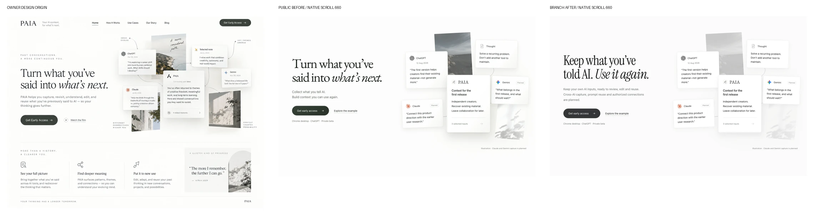

# V7 visual review

Draft only. No production deployment.

## Paired desktop hero

| Language | Public before | Branch after |
| --- | --- | --- |
| EN | [Native 660px](before-en-1440-scroll.webp) | [Native 660px](after-en-1440-scroll.webp) |
| ZH | [Native 660px](before-zh-1440-scroll.webp) | [Native 660px](after-zh-1440-scroll.webp) |

## Complete pages and fallback

Full-page screenshots use reduced motion. Native start/mid/resolved captures are separate.

| Locale | 1440 | 768 | 390 | 320 | No JS |
| --- | --- | --- | --- | --- | --- |
| EN | [1440](after-en-1440-full.webp) | [768](after-en-768-full.webp) | [390](after-en-390-full.webp) | [320](after-en-320-full.webp) | [1440](after-en-nojs.webp) |
| ZH | [1440](after-zh-1440-full.webp) | [768](after-zh-768-full.webp) | [390](after-zh-390-full.webp) | [320](after-zh-320-full.webp) | [1440](after-zh-nojs.webp) |

## Product details

EN: [archive](after-en-archive.webp) · [prompts](after-en-prompts.webp) · [topics](after-en-topics.webp) · [context](after-en-context.webp)
ZH: [archive](after-zh-archive.webp) · [prompts](after-zh-prompts.webp) · [topics](after-zh-topics.webp) · [context](after-zh-context.webp)

[Design origin](design-origin.webp) · [Test summary](test-summary.json) · [Public baseline digests](production-before.json) · [Screenshot sizes/digests](screenshots.json)

Browser evidence uses fictional page-local data. No form submission or AI connection.
