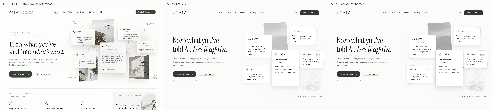
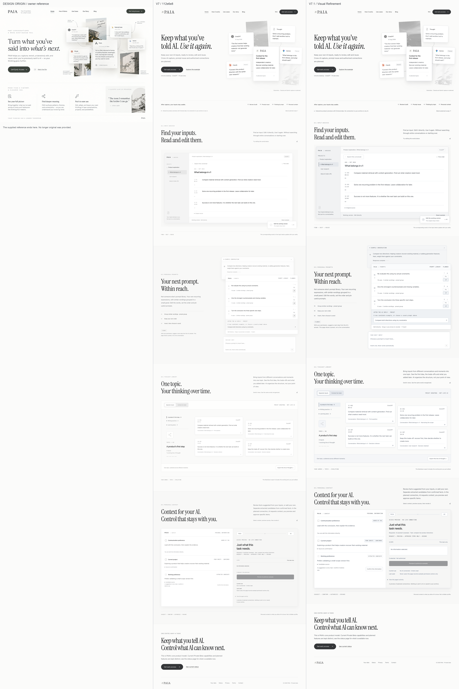
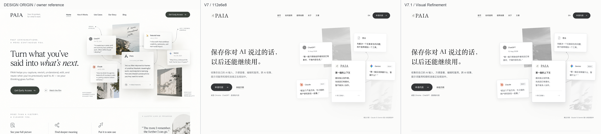

# V7.1 Owner Visual Review

Draft PR #98. One refinement pass; stop for owner review. No merge or deployment.

Each comparison column is 1440 pixels wide. Order: **design origin / V7 / V7.1**.
The owner supplied one 1448×1086 reference image; it is proportionally normalized
to 1440px and ends after 1080px. No additional original page is invented.
Hero comparisons show the first 900px of the completed composition. Full-page
captures use reduced motion so all content is visible. Native scroll is below.

## English

## 中文

## 02–05, 1:1 UI crops

Captured at 1440px viewport and device scale 1. UI pixels are not resized.
These are actual page interactions with the existing fictional examples.

| Scene | State | English | 中文 |
| --- | --- | --- | --- |
| 02 Input Archive | Working text focused; original source expanded | [1:1](detail-en-02.webp) | [1:1](detail-zh-02.webp) |
| 03 Prompt Reuse | First prompt pinned; reply suggestion inserted, not sent | [1:1](detail-en-03.webp) | [1:1](detail-zh-03.webp) |
| 04 Topic | Connected chronological view with conversation provenance | [1:1](detail-en-04.webp) | [1:1](detail-zh-04.webp) |
| 05 Context | Confirmed project selected and authorized; candidate remains unconfirmed; actual use stays zero | [1:1](detail-en-05.webp) | [1:1](detail-zh-05.webp) |

## Native hero and complete pages

| Locale | Start | 260px scroll | Cards revealed / 660px | Complete 1440 | 768 | 390 | 320 | No JS |
| --- | --- | --- | --- | --- | --- | --- | --- | --- |
| EN | [Start](v71-en-1440-start.webp) | [Mid](v71-en-1440-mid.webp) | [Revealed](v71-en-1440-scroll.webp) | [Full](v71-en-1440-full.webp) | [768](v71-en-768-full.webp) | [390](v71-en-390-full.webp) | [320](v71-en-320-full.webp) | [No JS](v71-en-nojs.webp) |
| ZH | [起始](v71-zh-1440-start.webp) | [中途](v71-zh-1440-mid.webp) | [浮现](v71-zh-1440-scroll.webp) | [长图](v71-zh-1440-full.webp) | [768](v71-zh-768-full.webp) | [390](v71-zh-390-full.webp) | [320](v71-zh-320-full.webp) | [No JS](v71-zh-nojs.webp) |

[Previous V7 evidence](../v7/README.md) · [Implementation receipt](../WEBSITE_V71_REFINEMENT.md)
· [Local test summary](test-summary.json) · [Image sizes and digests](screenshots.json)
